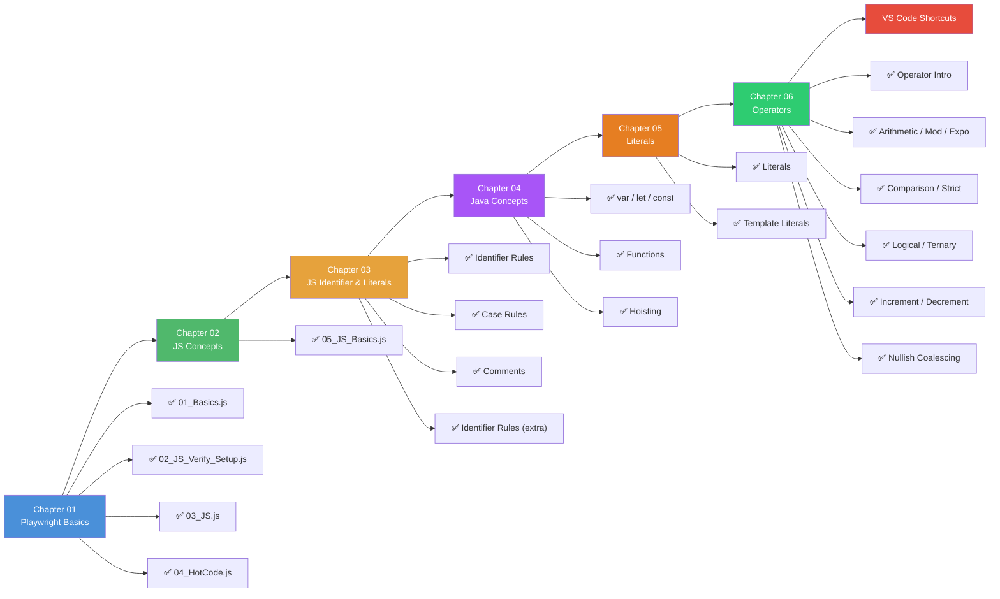
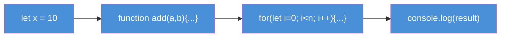
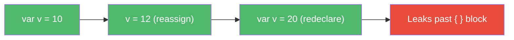
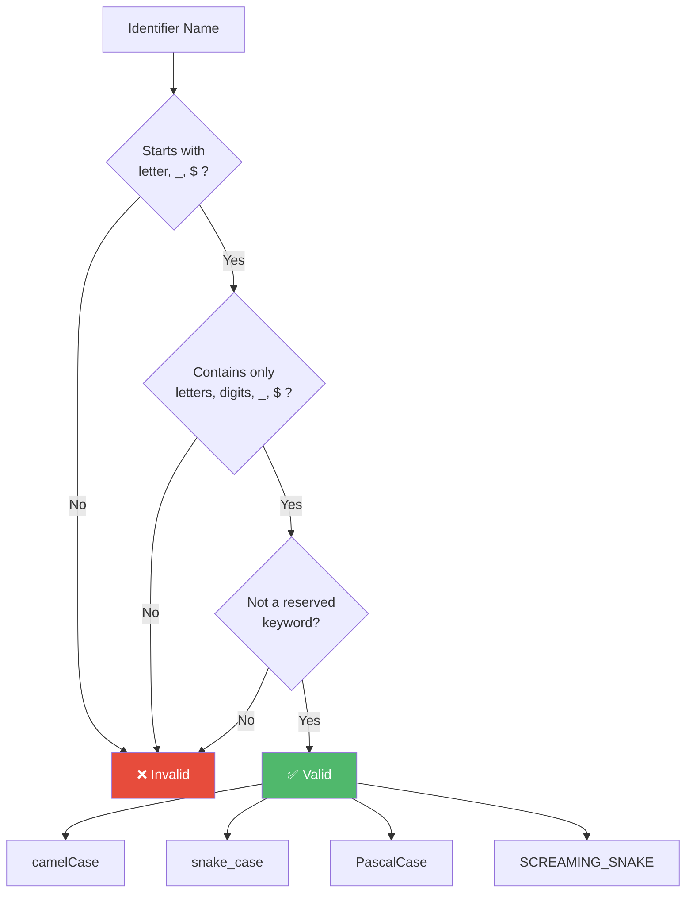
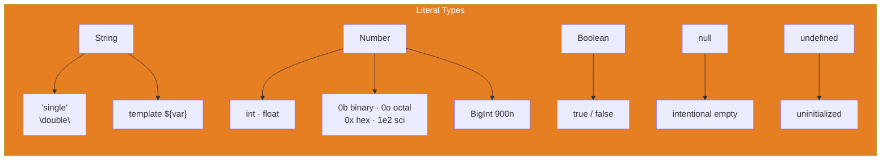

# 🎭 Playwright

> A hands-on journey into **Playwright** automation with **JavaScript** 🚀

[](https://github.com/Hemalatha-R17/Playwright)
[](https://github.com/Hemalatha-R17/Playwright)
[](https://github.com/Hemalatha-R17/Playwright)

<div align="center">

  

</div>

---

## 🗺️ Learning Flow



---

## 📂 Chapters

| #   | Chapter                      | 📄 Files                                                                                                                                                             |
| --- | ---------------------------- | -------------------------------------------------------------------------------------------------------------------------------------------------------------------- |
| 01  | **Playwright Basics**        | `01_Basics.js` · `02_JS_Verify_Setup.js` · `03_JS.js` · `04_HotCode.js`                                                                                              |
| 02  | **JS Concepts**              | `05_JS_Basics.js`                                                                                                                                                    |
| 03  | **JS Identifier & Literals** | `06_Identifier_Rules.js` · `07_Identifier_Case_Rules.js` · `08_Comments.js` · `js_identifier_rules.js` · `VS_Code_shortcuts_mac.md` · `VS_Code_shortcuts_windows.md` |
| 04  | **Java Concepts**            | `09_var_let_const.js` · `10_functions.js` · `11_var_explained.js` · `12_let_people_love.js` · `13_const_explained.js` · `14_var_functionscope.js` · `15_let_scope.js` · `16_Hoisting.js` · `17_hoisting_fn.js` |
| 05  | **Literals**                 | `22_Literal.js` · `23_null_undefined.js` · `24_null.js` · `25_Literal_All.js` · `26_Literal_Number_all.js` · `27_String.js` · `28_Template_Literal.js` · `29_Backtick_single_double.js` |
| 06  | **Operators**                | `30_Operator.js` · `31_Arithmetic_OP.js` · `32_Module_OP.js` · `33_Expo_OP.js` · `34_IQ_Compound_OP.js` · `35_Comparision_OP.js` · `36_Comparision_Strict_loose.js` · `37_IQ_Loose_Strict.js` · `38_Confusing_Comparision.js` · `39_Logical_OP.js` · `40_String_Con_OP.js` · `41_Ternary_OP.js` · `42_Type_OP.js` · `43_Incre_Decre_OP.js` · `44_Null_OP.js` |

---

## 📁 Folder Structure

```
Playwright/
├── README.md
├── .gitignore
├── Chapter_01_Basics/
│   ├── 01_Basics.js
│   ├── 02_JS_Verify_Setup.js
│   ├── 03_JS.js
│   └── 04_HotCode.js
├── Chapter_02_JS_Concepts/
│   └── 05_JS_Basics.js
├── Chapter_03_JS_Identifier_Literals/
│   ├── 06_Identifier_Rules.js
│   ├── 07_Identifier_Case_Rules.js
│   ├── 08_Comments.js
│   ├── js_identifier_rules.js
│   ├── VS_Code_shortcuts_mac.md
│   └── VS_Code_shortcuts_windows.md
├── Chapter_04_JavaConcepts/
│   ├── 09_var_let_const.js
│   ├── 10_functions.js
│   ├── 11_var_explained.js
│   ├── 12_let_people_love.js
│   ├── 13_const_explained.js
│   ├── 14_var_functionscope.js
│   ├── 15_let_scope.js
│   ├── 16_Hoisting.js
│   ├── 17_hoisting_fn.js
│   ├── 18_let_hoisting.js
│   ├── 19_let_hoisting_block.js
│   ├── 20_let_const.js
│   └── 21_Jr_QA.js
├── Chapter_05_Literal/
│   ├── 22_Literal.js
│   ├── 23_null_undefined.js
│   ├── 24_null.js
│   ├── 25_Literal_All.js
│   ├── 26_Literal_Number_all.js
│   ├── 27_String.js
│   ├── 28_Template_Literal.js
│   └── 29_Backtick_single_double.js
└── Chapter_06_Operator/
    ├── 30_Operator.js
    ├── 31_Arithmetic_OP.js
    ├── 32_Module_OP.js
    ├── 33_Expo_OP.js
    ├── 34_IQ_Compound_OP.js
    ├── 35_Comparision_OP.js
    ├── 36_Comparision_Strict_loose.js
    ├── 37_IQ_Loose_Strict.js
    ├── 38_Confusing_Comparision.js
    ├── 39_Logical_OP.js
    ├── 40_String_Con_OP.js
    ├── 41_Ternary_OP.js
    ├── 42_Type_OP.js
    ├── 43_Incre_Decre_OP.js
    └── 44_Null_OP.js
```

---

## 📖 Key Concepts by Chapter

<details open>
<summary><strong>📘 Chapter 01 — Playwright Basics</strong></summary>
<br>

Introduces foundational JS syntax used alongside Playwright: printing output, verifying the Node.js environment, declaring variables, and writing functions with loops.



| Concept | Code |
|---------|------|
| Output | `console.log("hello")` |
| Detect OS | `process.platform` / `process.arch` / `process.version` |
| Variable | `let x = 10` |
| Function | `function add(a,b){ return a+b }` |
| Loop | `for(let i=0; i<10; i++){ }` |

</details>

<details open>
<summary><strong>📗 Chapter 02 — JS Concepts</strong></summary>
<br>

Covers the older `var` keyword — how it's declared, reassigned, and how it leaks outside block scope (unlike `let`/`const`).



| Concept | Behaviour |
|---------|-----------|
| Declaration | `var v = 10` |
| Reassignment | `v = 12` ✅ |
| Redeclaration | `var v = 20` ✅ (allowed) |
| Scope | Function-scoped (leaks out of `{ }`) |

</details>

<details open>
<summary><strong>📙 Chapter 03 — JS Identifier & Literals</strong></summary>
<br>

Explores valid JS identifier rules, common naming conventions, and how to write comments for documentation.



| Naming Convention | Example | Use Case |
|-------------------|---------|----------|
| **camelCase** | `firstName` | variables, functions |
| **snake_case** | `first_name` | legacy / Python style |
| **PascalCase** | `FirstName` | classes, constructors |
| **SCREAMING_SNAKE** | `API_KEY` | constants |
| **Hungarian** | `strName`, `isActive` | type-prefixed names |

| Comment Style | Syntax |
|---------------|--------|
| Single-line | `// text` |
| Multi-line | `/* text */` |
| JSDoc | `/** @param {string} name */` |

</details>

<details open>
<summary><strong>🟣 Chapter 04 — Java Concepts (Variables & Functions)</strong></summary>
<br>

Deep-dive into `var` vs `let` vs `const` — scoping rules, redeclaration, reassignment, hoisting behaviour, and Temporal Dead Zone (TDZ).

```mermaid
flowchart TD
    subgraph var["var"]
        v1["function-scoped"] --> v2["✅ redeclarable"]
        v2 --> v3["✅ reassignable"]
        v3 --> v4["hoisted → undefined"]
    end
    subgraph let["let"]
        l1["block-scoped"] --> l2["❌ redeclarable"]
        l2 --> l3["✅ reassignable"]
        l3 --> l4["hoisted → TDZ ❌"]
    end
    subgraph const["const"]
        c1["block-scoped"] --> c2["❌ redeclarable"]
        c2 --> c3["❌ reassignable"]
        c3 --> c4["hoisted → TDZ ❌"]
    end

    style var fill:#a855f7,color:#fff
    style let fill:#a855f7,color:#fff
    style const fill:#a855f7,color:#fff
```



| Feature | `var` | `let` | `const` |
|---------|-------|-------|---------|
| Scope | Function | Block | Block |
| Redeclare | ✅ | ❌ | ❌ |
| Reassign | ✅ | ✅ | ❌ |
| Hoisting | `undefined` | TDZ (ReferenceError) | TDZ (ReferenceError) |

Functions: define once with `function name(){}` → invoke many times with `name()`.

</details>

<details open>
<summary><strong>🟠 Chapter 05 — Literals</strong></summary>
<br>

Covers all literal value types in JavaScript — strings, numbers, booleans, null, undefined — and the modern template literal syntax.



| Type | Examples |
|------|----------|
| String | `'hello'`, `"world"` |
| Template | `` `Hi ${name}` `` — interpolation + multi-line |
| Number | `42`, `3.14`, `0xFF`, `0b1010`, `0o77`, `1_000_000`, `900n` |
| Boolean | `true`, `false` |
| Null | `let x = null` |
| Undefined | `let x;` (no assignment) |

💡 `null` is an *intentional* absence of value; `undefined` is JS's default *uninitialized* state.

</details>

<details open>
<summary><strong>🟢 Chapter 06 — Operators</strong></summary>
<br>

All major JS operator categories — assignment, arithmetic, comparison, logical, ternary, type, increment/decrement, and nullish coalescing.

```mermaid
flowchart TD
    O["JS Operators"] --> A["= Assignment"]
    O --> B["+ - * / % **<br/>Arithmetic"]
    O --> C["+= -= *= /= %=<br/>Compound"]
    O --> D["&gt; &lt; &gt;= &lt;=<br/>Comparison"]
    O --> E["==  ===  !=  !==<br/>Equality"]
    O --> F["&amp;&amp;  &#124;&#124;  !<br/>Logical"]
    O --> G["? :<br/>Ternary"]
    O --> H["typeof<br/>Type"]
    O --> I["++ --<br/>Inc/Dec"]
    O --> J["??<br/>Nullish"]

    style O fill:#2ecc71,color:#fff
```



| Category | Operators | Example |
|----------|-----------|---------|
| Assignment | `=` | `x = 10` |
| Arithmetic | `+ - * / % **` | `10 % 3 → 1`, `2 ** 3 → 8` |
| Compound | `+= -= *= /= %=` | `x += 5` → `x = x + 5` |
| Comparison | `> < >= <=` | `5 > 3 → true` |
| Equality (loose) | `==` | `5 == '5' → true` (coerces) |
| Equality (strict) | `===` | `5 === '5' → false` (type+value) |
| Logical | `&& \|\| !` | `true && false → false` |
| Ternary | `? :` | `age >= 18 ? 'adult' : 'minor'` |
| Type | `typeof` | `typeof 42 → 'number'` |
| Inc/Dec | `++ --` | `i++` |
| Nullish | `??` | `x ?? 'default'` (if x is null/undefined) |

⚡ **Rule of thumb**: always prefer `===` over `==` unless you intentionally want type coercion.

</details>

---

## ⌨️ VS Code Shortcuts

Quick reference guides for **Mac** and **Windows**:

| Platform   | File                                                                                             |
| ---------- | ------------------------------------------------------------------------------------------------ |
| 🍎 Mac     | [`VS_Code_shortcuts_mac.md`](Chapter_03_JS_Identifier_Literals/VS_Code_shortcuts_mac.md)         |
| 🪟 Windows | [`VS_Code_shortcuts_windows.md`](Chapter_03_JS_Identifier_Literals/VS_Code_shortcuts_windows.md) |

---

## 🛠️ Tech Stack

- **Playwright** — Browser automation
- **JavaScript (ES6+)** — Programming language
- **Node.js** — Runtime environment

---

<div align="center">
  <sub>Built with ❤️ by Hemalatha</sub>
</div>
