# 🎭 Playwright

> A hands-on journey into **Playwright** automation with **JavaScript** 🚀

[](https://github.com/Hemalatha-R17/Playwright)
[](https://github.com/Hemalatha-R17/Playwright)
[](https://github.com/Hemalatha-R17/Playwright)

<div align="center">

  

</div>

---

## 🗺️ Learning Flow

```mermaid
flowchart LR
    A[Chapter 01<br/>Playwright Basics] --> B[Chapter 02<br/>JS Concepts]
    B --> C[Chapter 03<br/>JS Identifier & Literals]
    C --> D[Chapter 04<br/>Java Concepts]
    D --> E[Chapter 05<br/>Literals]
    E --> F[Chapter 06<br/>Operators]
    F --> G[Chapter 07<br/>If-Else]
    G --> H[Chapter 08<br/>Switch Statement]
    H --> I[Chapter 09<br/>User Input]

    A --> A1["✅ 01_Basics.js"]
    A --> A2["✅ 02_JS_Verify_Setup.js"]
    A --> A3["✅ 03_JS.js"]
    A --> A4["✅ 04_HotCode.js"]

    B --> B1["✅ 05_JS_Basics.js"]

    C --> C1["✅ Identifier Rules"]
    C --> C2["✅ Case Rules"]
    C --> C3["✅ Comments"]
    C --> C4["✅ Identifier Rules (extra)"]

    D --> D1["✅ var / let / const"]
    D --> D2["✅ Functions"]
    D --> D3["✅ Hoisting"]

    E --> E1["✅ Literals"]
    E --> E2["✅ Template Literals"]

    F --> F1["✅ Operator Intro"]
    F --> F2["✅ Arithmetic / Mod / Expo"]
    F --> F3["✅ Comparison / Strict"]
    F --> F4["✅ Logical / Ternary"]
    F --> F5["✅ Increment / Decrement"]
    F --> F6["✅ Nullish Coalescing"]

    G --> G1["✅ If / Else If / Else"]
    G --> G2["✅ Real-world examples"]
    G --> G3["✅ Grade Calc / Leap Year"]

    H --> H1["✅ Switch / Case"]
    H --> H2["✅ Break / Default"]
    H --> H3["✅ Group / IQ patterns"]

    I --> J[Chapter 10<br/>Loops]
    J --> K[Chapter 11<br/>Arrays]

    J --> J1["✅ for loop"]
    J --> J2["✅ while loop"]
    J --> J3["✅ do-while loop"]
    J --> J4["✅ continue"]
    J --> J5["✅ IQ traps"]

    K --> K1["✅ Arrays Intro"]
    K --> K2["✅ Another Array"]
    K --> K3["✅ Access"]
    K --> K4["✅ Adding / Remove"]
    K --> K5["✅ More Adding/Remove"]
    K --> K6["✅ Real Example"]
    K --> K7["✅ Searching"]
    K --> K8["✅ Iterate"]
    K --> K9["✅ Transform"]
    K --> K10["✅ More Arrays"]
    K --> K11["✅ Array Slicing"]
    K --> K12["✅ Concat"]
    K --> K13["✅ Array Checking"]

    K --> L[Chapter 12<br/>Functions]
    L --> L1["✅ Basic Functions"]
    L --> L2["✅ Fn With Param No Return"]
    L --> L3["✅ Fn Without Param With Return"]
    L --> L4["✅ Fn With Param With Return"]
    L --> L5["✅ Template Literal"]
    L --> L6["✅ Fn Expression"]
    L --> L7["✅ Arrow Fn"]
    L --> L8["✅ IIFE / Default Params"]
    L --> L9["✅ Closures / HOF"]

    L --> M[Chapter 13<br/>Strings]
    M --> N[Chapter 14<br/>Objects]
    N --> O[Chapter 15<br/>2D Arrays]
    O --> P[Chapter 16<br/>Callbacks]
    P --> Q[Chapter 17<br/>Promises]
    Q --> R[Chapter 18<br/>Async/Await]
    R --> S[Chapter 19<br/>Playwright Basics]
    S --> T[Chapter 20<br/>TypeScript]
    T --> U[Chapter 21<br/>OOPs]

    U --> U1["✅ Class & Object"]
    U --> U2["✅ Constructor"]
    U --> U3["✅ Methods"]
    U --> U4["✅ Private Fields"]
    U --> U5["✅ Static"]

    U --> V[Chapter 22<br/>Encapsulation]
    V --> W[Chapter 23<br/>Inheritance]
    W --> X[Chapter 24<br/>Polymorphism]
    X --> Y[Chapter 25<br/>OOP IQ]
    Y --> Z[Chapter 26<br/>TypeScript]
    Z --> AA[Chapter 27<br/>TS Interface]
    AA --> AB[Chapter 28<br/>Enums]
    AB --> AC[Chapter 29<br/>Generics]
    AC --> AD[Chapter 30<br/>PPP]
    AD --> AE[Chapter 31<br/>Type/Decorators]
    AE --> AF[Chapter 32<br/>Playwright Fund.]

    V --> V1["✅ Private Fields"]
    V --> V2["✅ Getter / Setter"]
    V --> V3["✅ Guarded Setter"]

    W --> W1["✅ Single Inheritance"]
    W --> W2["✅ super() / extends"]
    W --> W3["✅ Multi-level / Hierarchical"]
    W --> W4["✅ Real POM"]

    X --> X1["✅ Method Overriding"]

    Y --> Y1["✅ Bug / default params"]
    Y --> Y2["✅ this / chaining"]

    Z --> Z1["✅ TS basics / types"]
    Z --> Z2["✅ IQ patterns"]

    AA --> AA1["✅ Interface"]
    AA --> AA2["✅ readonly"]

    AB --> AB1["✅ Enum values"]
    AC --> AC1["✅ Generic Functions"]
    AD --> AD1["✅ private/protected"]
    AE --> AE1["✅ as / Override"]
    AE --> AE2["✅ Decorators"]
    AF --> AF1["✅ playwright.config.ts"]
    AF --> AF2["✅ First test"]

    style A fill:#4a90d9,color:#fff
    style B fill:#50b86c,color:#fff
    style C fill:#e6a23c,color:#fff
    style D fill:#a855f7,color:#fff
    style E fill:#e67e22,color:#fff
    style F fill:#2ecc71,color:#fff
    style G fill:#e74c3c,color:#fff
    style H fill:#f39c12,color:#fff
    style I fill:#3498db,color:#fff
    style J fill:#1abc9c,color:#fff
    style K fill:#e91e63,color:#fff
    style L fill:#a855f7,color:#fff
    style M fill:#e74c3c,color:#fff
    style N fill:#f39c12,color:#fff
    style O fill:#3498db,color:#fff
    style P fill:#1abc9c,color:#fff
    style Q fill:#e91e63,color:#fff
    style R fill:#50b86c,color:#fff
    style S fill:#4a90d9,color:#fff
    style T fill:#a855f7,color:#fff
    style U fill:#e74c3c,color:#fff
    style V fill:#50b86c,color:#fff
    style W fill:#e67e22,color:#fff
    style X fill:#9b59b6,color:#fff
    style Y fill:#e74c3c,color:#fff
    style Z fill:#3498db,color:#fff
    style AA fill:#1abc9c,color:#fff
    style AB fill:#e91e63,color:#fff
    style AC fill:#a855f7,color:#fff
    style AD fill:#e74c3c,color:#fff
    style AE fill:#f39c12,color:#fff
    style AF fill:#4a90d9,color:#fff
```

---

## 📂 Chapters

| #   | Chapter                      | 📄 Files                                                                                                                                                             |
| --- | ---------------------------- | -------------------------------------------------------------------------------------------------------------------------------------------------------------------- |
| 01  | **Playwright Basics**        | `01_Basics.js` · `02_JS_Verify_Setup.js` · `03_JS.js` · `04_HotCode.js`                                                                                              |
| 02  | **JS Concepts**              | `05_JS_Basics.js`                                                                                                                                                    |
| 03  | **JS Identifier & Literals** | `06_Identifier_Rules.js` · `07_Identifier_Case_Rules.js` · `08_Comments.js` · `js_identifier_rules.js` · `VS_Code_shortcuts_mac.md` · `VS_Code_shortcuts_windows.md` |
| 04  | **Java Concepts**            | `09_var_let_const.js` · `10_functions.js` · `11_var_explained.js` · `12_let_people_love.js` · `13_const_explained.js` · `14_var_functionscope.js` · `15_let_scope.js` · `16_Hoisting.js` · `17_hoisting_fn.js` |
| 05  | **Literals**                 | `22_Literal.js` · `23_null_undefined.js` · `24_null.js` · `25_Literal_All.js` · `26_Literal_Number_all.js` · `27_String.js` · `28_Template_Literal.js` · `29_Backtick_single_double.js` |
| 06  | **Operators**                | `30_Operator.js` · `31_Arithmetic_OP.js` · `32_Modulus_OP.js` · `33_Expo_OP.js` · `34_IQ.js` · `35_Comparsion_OP.js` · `36_Comparsion_Strict_loose.js` · `37_IQ_Loose_Strict.js` · `38_Confusing_Comparsion.js` · `39_Logical_Op.js` · `40_String_Con_Op.js` · `41_Ternary_Op.js` · `42_Type_Op.js` · `43_Incre_Decre_Op.js` · `44_Null_Op.js` · `45_Post_Increment.js` · `46_IQ_INCREMENT_D.js` · `47_Advance_ID_.js` |
| 07  | **If-Else**                  | `48_IF_ESLE.js` · `49_If_elseif_else.js` · `50_REAL_IF_ELSE.js` · `51_API_IF_ELSE.js` · `52_IQ_IF_ELSE.js` · `53_IF_ELSE_real.js` · `54_IQ.js` · `55_IE.js` · `56_IQ_EVEN_ODD.js` · `57_Grade_Calc.js` · `58_LEAP_YEAR.js` |
| 08  | **Switch Statement**         | `59_Switch.js` · `60_No_Break.js` · `61_Default.js` · `62_REAL_TIME_EXAMPLE.js` · `63_Switch_Group.js` · `64_IQ.js` · `65_IQ2.js` · `66_IQ3.js` · `67_IQ4.js` |
| 09  | **User Input**               | `68_User_Input.js` · `69_Node_readline.js` · `70_prompt_sync.js` |
| 10  | **Loops**                    | `71_For_loop.js` · `72_For_loop.js` · `73_For_Loop2.js` · `74_IQ.js` · `75_For_OF_IN_EACH.js` · `76_While.js` · `77_Do_While.js` · `78_Do_While.js` · `79_IQ.js` · `80_IQ.js` · `81_IQ.js` · `82_IQ.js` |
| 11  | **Arrays**                   | `83_Arrays.js` · `84_Arrays.js` · `85_Access_Array.js` · `86_Arrays_Adding_Remove.js` · `87_Adding_Remove2.js` · `88_REAL_Example.js` · `89_Searching.js` · `90_Iterate.js` · `91_Transform_Array.js` · `92_Arrays.js` · `93_Array_Slicing.js` · `94_Concat_array.js` · `95_Array_Checking.js` |
| 12  | **Functions**                | `96_Functions.js` · `97_Type1_Fn_Basic_Functions.js` · `98_Type2_Fn_With_Param_No_Return.js` · `99_Type3_Fn_without_Param_Return_Type.js` · `100_Type4_Fn_With_Param_With_Return.js` · `101_Template_literal.js` · `102_Fn_Expression.js` · `103_Arrow_Fn.js` · `104_Arrow_Fn_REAL.js` · `105_IIFE.js` · `106_Default_Param_Fn.js` · `107_IQ.js` · `108_Rest_Param_Fn.js` · `109_IQ.js` · `110_Spead_IQ.js` · `111_Scope._Fn.js` · `112_IQ.js` · `113_Closure.js` · `114_Closure.js` · `115_API_REAL_Closure.js` · `116_Higher_Order_Fn.js` · `117_Pure_Fn.js` |
| 13  | **Strings**                  | `118_Strings.js` · `119_String_Properties.js` · `120_Search_Check_Str.js` · `121_Substring.js` · `122_Transform_Str.js` · `123_String_Conversion.js` |
| 14  | **Objects**                  | `124_Objects.js` · `125_Objects2.js` · `126_Objects_Creation.js` · `127_Objects_REAL.js` · `128_Primitive_Ref.js` · `129_Ob_Examples.js` · `130_IQ.js` · `131_Object_Fn.js` · `132_Obj_Decon.js` · `133_Spead.js` · `134_Objects_GET_SET_Methods.js` · `135_IQ` · `136_Obj_REAL.js` · `137_Let_const_obj.js` |
| 15  | **2D Arrays**                | `138_2D_Array.js` · `139_2d.js` · `140_REAL.js` · `141_2d_Array_Fn.js` · `142_IQ_Right_Pattern_Py.js` |
| 16  | **Callbacks**                | `143_Callback.js` · `144_CB.js` · `145_CB_Fn.js` · `146_PW_CB.js` · `147_JS_CB.js` · `148_Sync_CB.js` · `149_Async_CB.js` · `150_CB_Hell.js` · `151_CB_Hell_20_Steps.js` · `152_CB_Parameter.js` · `153_CB_Return.js` |
| 17  | **Promises**                 | `154_Promise.js` · `155_Promise_REAL_API.js` · `156_Promise_REAL_API_PART2.js` · `157_Finally.js` · `158_Call_Py_Problem.js` · `159_Promise_ALL.js` · `160_Promise_IQ.js` |
| 18  | **Async / Await**            | `161_Async.js` · `162_Aysnc_P2.js` · `163_PyODom.js` · `164_Async_Ex.js` · `165_AA_Parallel.js` · `165_AA_Seq.js` · `166_IQ.js` · `167_ACLogin.js` |
| 19  | **Playwright Basics**        | `playwright.config.ts` · `tests/` · `package.json` |
| 20  | **TypeScript Basics**        | `logger.js` · `testutils.js` · `utils.js` · `EXPORT_IMPORT/` |
| 21  | **OOPs**                     | `171_Class_Object.js` · `172_Class_Object2.js` · `173_Car.js` · `174_REAL_Browser.js` · `175_IQ.js` · `176_Private_Public.js` · `177_Statis.js` · `178_Statis.js` |
| 22  | **Encapsulation**            | `179_Ecap.js` · `180_REAK_EXAMPLE.js` · `181_Ecap_Car.js` · `182_ECap_Bank.js` |
| 23  | **Inheritance**              | `183_Single_Inheritance.js` · `184_SI_Example.js` · `185_Single_Inheritance_Con.js` · `186_IQ.js` · `187_IQ2.js` · `188_REAL_PageObject_Model.js` · `189_Multiple_Inheritance.js` · `190_Multiple_Level_Inheritance.js` · `191_Hierarchial_Inheritance.js` |
| 24  | **Polymorphism**             | `192_Method_Overriding.js` |
| 25  | **OOP Interview Questions**  | `EX1.js` · `EX2.js` · `EX3.js` · `EX4.js` |
| 26  | **TypeScript**               | `193_TS.js` · `194_TS_HelloWorld.js` · `194_TS_HelloWorld.ts` · `195_TS_Part1.ts` · `196_TS_Part2.ts` · `197_TS_Part2.ts` · `198_Part3.ts` · `199_IQ.ts` · `200_IQ.ts` |
| 27  | **TypeScript Interface**     | `201_IF.ts` · `202_IF_Part2.ts` · `203_IF_READONLY.ts` · `204_IF_READOnly.ts` · `205_Interfaces.ts` · `206_Hooks.ts` · `207_Bug REPORT.ts` · `208_TestConfig.ts` · `209_REAL_EXAMPLE.ts` · `210_Class_Interface.ts` |
| 28  | **Enums**                    | `211_ENUM.ts` · `212_Enum_Fn.ts` · `213_ENUM.ts` · `214_API_.ts` |
| 29  | **TypeScript Generics**      | `215_Generic.ts` · `216_Generic_Class.ts` · `217_Generic_API_RESPONSE.ts` |
| 30  | **Private / Public / Protected** | `218_PPP.ts` · `219_PageObjectModel.ts` · `220_READONLY.ts` · `221_Abstract_Class.ts` |
| 31  | **Type Override & Decorators** | `222_Type_As.ts` · `223_Type_Alias_As.ts` · `224_Override.ts` · `225_IQ.ts` · `226_Decorator.ts` · `227_Decortors_2.ts` · `228_Multiple_Decor.ts` |
| 32  | **Playwright Fundamentals**  | `playwright.config.ts` · `tests/example.spec.ts` · `package.json` |

---

## 📁 Folder Structure

```
Playwright/
├── README.md
├── .gitignore
├── Chapter_01_Basics/
│   ├── 01_Basics.js
│   ├── 02_JS_Verify_Setup.js
│   ├── 03_JS.js
│   └── 04_HotCode.js
├── Chapter_02_JS_Concepts/
│   └── 05_JS_Basics.js
├── Chapter_03_JS_Identifier_Literals/
│   ├── 06_Identifier_Rules.js
│   ├── 07_Identifier_Case_Rules.js
│   ├── 08_Comments.js
│   ├── js_identifier_rules.js
│   ├── VS_Code_shortcuts_mac.md
│   └── VS_Code_shortcuts_windows.md
├── Chapter_04_JavaConcepts/
│   ├── 09_var_let_const.js
│   ├── 10_functions.js
│   ├── 11_var_explained.js
│   ├── 12_let_people_love.js
│   ├── 13_const_explained.js
│   ├── 14_var_functionscope.js
│   ├── 15_let_scope.js
│   ├── 16_Hoisting.js
│   ├── 17_hoisting_fn.js
│   ├── 18_let_hoisting.js
│   ├── 19_let_hoisting_block.js
│   ├── 20_let_const.js
│   └── 21_Jr_QA.js
├── Chapter_05_Literal/
│   ├── 22_Literal.js
│   ├── 23_null_undefined.js
│   ├── 24_null.js
│   ├── 25_Literal_All.js
│   ├── 26_Literal_Number_all.js
│   ├── 27_String.js
│   ├── 28_Template_Literal.js
│   └── 29_Backtick_single_double.js
├── Chapter_06_Operator/
│   ├── 30_Operator.js
│   ├── 31_Arithmetic_OP.js
│   ├── 32_Modulus_OP.js
│   ├── 33_Expo_OP.js
│   ├── 34_IQ.js
│   ├── 35_Comparsion_OP.js
│   ├── 36_Comparsion_Strict_loose.js
│   ├── 37_IQ_Loose_Strict.js
│   ├── 38_Confusing_Comparsion.js
│   ├── 39_Logical_Op.js
│   ├── 40_String_Con_Op.js
│   ├── 41_Ternary_Op.js
│   ├── 42_Type_Op.js
│   ├── 43_Incre_Decre_Op.js
│   ├── 44_Null_Op.js
│   ├── 45_Post_Increment.js
│   ├── 46_IQ_INCREMENT_D.js
│   ├── 47_Advance_ID_.js
│   └── README.md
├── Chapter_07_If_else/
│   ├── 48_IF_ESLE.js
│   ├── 49_If_elseif_else.js
│   ├── 50_REAL_IF_ELSE.js
│   ├── 51_API_IF_ELSE.js
│   ├── 52_IQ_IF_ELSE.js
│   ├── 53_IF_ELSE_real.js
│   ├── 54_IQ.js
│   ├── 55_IE.js
│   ├── 56_IQ_EVEN_ODD.js
│   ├── 57_Grade_Calc.js
│   ├── 58_LEAP_YEAR.js
│   └── README.md
├── Chapter_08_Switch_Statement/
│   ├── 59_Switch.js
│   ├── 60_No_Break.js
│   ├── 61_Default.js
│   ├── 62_REAL_TIME_EXAMPLE.js
│   ├── 63_Switch_Group.js
│   ├── 64_IQ.js
│   ├── 65_IQ2.js
│   ├── 66_IQ3.js
│   ├── 67_IQ4.js
│   └── README.md
├── Chapter_09_UserInput/
│   ├── 68_User_Input.js
│   ├── 69_Node_readline.js
│   ├── 70_prompt_sync.js
│   └── README.md
├── Chapter_10_Loops/
│   ├── 71_For_loop.js
│   ├── 72_For_loop.js
│   ├── 73_For_Loop2.js
│   ├── 74_IQ.js
│   ├── 75_For_OF_IN_EACH.js
│   ├── 76_While.js
│   ├── 77_Do_While.js
│   ├── 78_Do_While.js
│   ├── 79_IQ.js
│   ├── 80_IQ.js
│   ├── 81_IQ.js
│   ├── 82_IQ.js
│   └── README.md
├── Chapter_11_Arrays/
│   ├── 83_Arrays.js
│   ├── 84_Arrays.js
│   ├── 85_Access_Array.js
│   ├── 86_Arrays_Adding_Remove.js
│   ├── 87_Adding_Remove2.js
│   ├── 88_REAL_Example.js
│   ├── 89_Searching.js
│   ├── 90_Iterate.js
│   ├── 91_Transform_Array.js
│   ├── 92_Arrays.js
│   ├── 93_Array_Slicing.js
│   ├── 94_Concat_array.js
│   └── 95_Array_Checking.js
├── Chapter_12_Funtions/
│   ├── 96_Functions.js
│   ├── 97_Type1_Fn_Basic_Functions.js
│   ├── 98_Type2_Fn_With_Param_No_Return.js
│   ├── 99_Type3_Fn_without_Param_Return_Type.js
│   ├── 100_Type4_Fn_With_Param_With_Return.js
│   ├── 101_Template_literal.js
│   ├── 102_Fn_Expression.js
│   └── 103_Arrow_Fn.js
├── Assignment/
        ├── Assignment_1.js
        ├── Assignment_2.js
        ├── Assignment_3.js
        ├── Assignment_4.js
        ├── Assignment_5.js
        ├── Assignment_6.js
        ├── Assignment_7.js
        ├── Assignment_8.js
        ├── Assignment_9.js
        ├── Assignment_10.js
        ├── Assignment_11.js
        ├── Assignment_12.js
        └── Assignment_13.js
├── Chapter_21_Classes_and_Objects/
│   ├── 171_Class_Object.js
│   ├── 172_Class_Object2.js
│   ├── 173_Car.js
│   ├── 174_REAL_Browser.js
│   ├── 175_IQ.js
│   ├── 176_Private_Public.js
│   ├── 177_Statis.js
│   └── 178_Statis.js
├── Chapter_22_Encapsulation/
│   ├── 179_Ecap.js
│   ├── 180_REAK_EXAMPLE.js
│   ├── 181_Ecap_Car.js
│   └── 182_ECap_Bank.js
├── Chapter_23_Inheritance/
│   ├── 183_Single_Inheritance.js
│   ├── 184_SI_Example.js
│   ├── 185_Single_Inheritance_Con.js
│   ├── 186_IQ.js
│   ├── 187_IQ2.js
│   ├── 188_REAL_PageObject_Model.js
│   ├── 189_Multiple_Inheritance.js
│   ├── 190_Multiple_Level_Inheritance.js
│   └── 191_Hierarchial_Inheritance.js
├── Chapter_24_Polymorphism/
│   └── 192_Method_Overriding.js
├── Chapter_25_OOP_Interview_Questions/
│   ├── EX1.js
│   ├── EX2.js
│   ├── EX3.js
│   └── EX4.js
├── Chapter_26_Typescript/
│   ├── 193_TS.js
│   ├── 194_TS_HelloWorld.js
│   ├── 194_TS_HelloWorld.ts
│   ├── 195_TS_Part1.ts
│   ├── 196_TS_Part2.ts
│   ├── 197_TS_Part2.ts
│   ├── 198_Part3.ts
│   ├── 199_IQ.ts
│   └── 200_IQ.ts
├── Chapter_27_TypeScript_Interface/
│   ├── 201_IF.ts
│   ├── 202_IF_Part2.ts
│   ├── 203_IF_READONLY.ts
│   ├── 204_IF_READOnly.ts
│   ├── 205_Interfaces.ts
│   ├── 206_Hooks.ts
│   ├── 207_Bug REPORT.ts
│   ├── 208_TestConfig.ts
│   ├── 209_REAL_EXAMPLE.ts
│   └── 210_Class_Interface.ts
├── Chapter_28_ENUM/
│   ├── 211_ENUM.ts
│   ├── 212_Enum_Fn.ts
│   ├── 213_ENUM.ts
│   └── 214_API_.ts
├── Chapter_29_Typescript_Generic/
│   ├── 215_Generic.ts
│   ├── 216_Generic_Class.ts
│   └── 217_Generic_API_RESPONSE.ts
├── Chapter_30_PRIVATE_PUBLIC_PROTECTED/
│   ├── 218_PPP.ts
│   ├── 219_PageObjectModel.ts
│   ├── 220_READONLY.ts
│   └── 221_Abstract_Class.ts
├── Chapter_31_Type_Overide_Decortors/
│   ├── 222_Type_As.ts
│   ├── 223_Type_Alias_As.ts
│   ├── 224_Override.ts
│   ├── 225_IQ.ts
│   ├── 226_Decorator.ts
│   ├── 227_Decortors_2.ts
│   ├── 228_Multiple_Decor.ts
│   └── tsconfig.json
├── Chapter_32_Playwright_Fundamentals/
│   ├── playwright.config.ts
│   ├── package.json
│   ├── tsconfig.json
│   └── tests/
│       └── example.spec.ts
├── tsconfig.json
```

---

## 📖 Key Concepts by Chapter

<details open>
<summary><strong>📘 Chapter 01 — Playwright Basics</strong></summary>
<br>

Introduces foundational JS syntax used alongside Playwright: printing output, verifying the Node.js environment, declaring variables, and writing functions with loops.

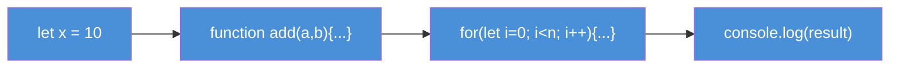

| Concept | Code |
|---------|------|
| Output | `console.log("hello")` |
| Detect OS | `process.platform` / `process.arch` / `process.version` |
| Variable | `let x = 10` |
| Function | `function add(a,b){ return a+b }` |
| Loop | `for(let i=0; i<10; i++){ }` |

</details>

<details open>
<summary><strong>📗 Chapter 02 — JS Concepts</strong></summary>
<br>

Covers the older `var` keyword — how it's declared, reassigned, and how it leaks outside block scope (unlike `let`/`const`).

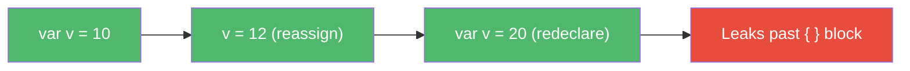

| Concept | Behaviour |
|---------|-----------|
| Declaration | `var v = 10` |
| Reassignment | `v = 12` ✅ |
| Redeclaration | `var v = 20` ✅ (allowed) |
| Scope | Function-scoped (leaks out of `{ }`) |

</details>

<details open>
<summary><strong>📙 Chapter 03 — JS Identifier & Literals</strong></summary>
<br>

Explores valid JS identifier rules, common naming conventions, and how to write comments for documentation.

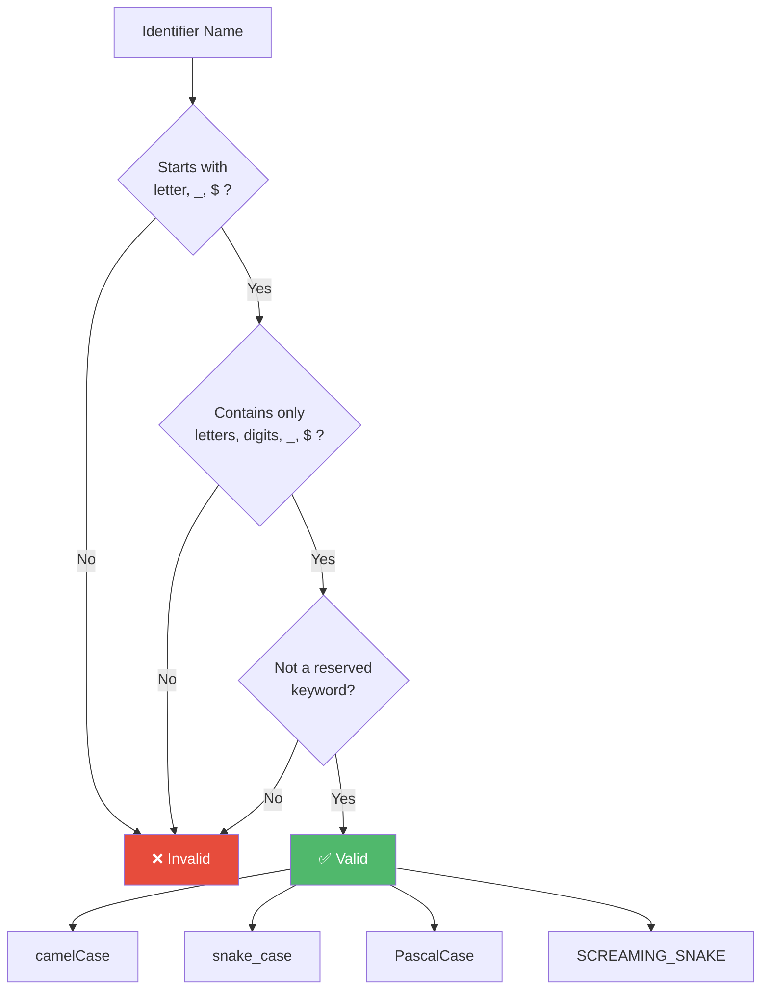

| Naming Convention | Example | Use Case |
|-------------------|---------|----------|
| **camelCase** | `firstName` | variables, functions |
| **snake_case** | `first_name` | legacy / Python style |
| **PascalCase** | `FirstName` | classes, constructors |
| **SCREAMING_SNAKE** | `API_KEY` | constants |
| **Hungarian** | `strName`, `isActive` | type-prefixed names |

| Comment Style | Syntax |
|---------------|--------|
| Single-line | `// text` |
| Multi-line | `/* text */` |
| JSDoc | `/** @param {string} name */` |

</details>

<details open>
<summary><strong>🟣 Chapter 04 — Java Concepts (Variables & Functions)</strong></summary>
<br>

Deep-dive into `var` vs `let` vs `const` — scoping rules, redeclaration, reassignment, hoisting behaviour, and Temporal Dead Zone (TDZ).

```mermaid
flowchart TD
    subgraph var["var"]
        v1["function-scoped"] --> v2["✅ redeclarable"]
        v2 --> v3["✅ reassignable"]
        v3 --> v4["hoisted → undefined"]
    end
    subgraph let["let"]
        l1["block-scoped"] --> l2["❌ redeclarable"]
        l2 --> l3["✅ reassignable"]
        l3 --> l4["hoisted → TDZ ❌"]
    end
    subgraph const["const"]
        c1["block-scoped"] --> c2["❌ redeclarable"]
        c2 --> c3["❌ reassignable"]
        c3 --> c4["hoisted → TDZ ❌"]
    end

    style var fill:#a855f7,color:#fff
    style let fill:#a855f7,color:#fff
    style const fill:#a855f7,color:#fff
```

| Feature | `var` | `let` | `const` |
|---------|-------|-------|---------|
| Scope | Function | Block | Block |
| Redeclare | ✅ | ❌ | ❌ |
| Reassign | ✅ | ✅ | ❌ |
| Hoisting | `undefined` | TDZ (ReferenceError) | TDZ (ReferenceError) |

Functions: define once with `function name(){}` → invoke many times with `name()`.

</details>

<details open>
<summary><strong>🟠 Chapter 05 — Literals</strong></summary>
<br>

Covers all literal value types in JavaScript — strings, numbers, booleans, null, undefined — and the modern template literal syntax.

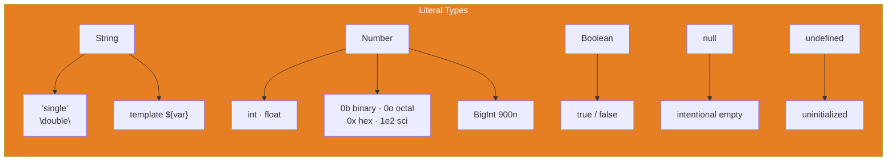

| Type | Examples |
|------|----------|
| String | `'hello'`, `"world"` |
| Template | `` `Hi ${name}` `` — interpolation + multi-line |
| Number | `42`, `3.14`, `0xFF`, `0b1010`, `0o77`, `1_000_000`, `900n` |
| Boolean | `true`, `false` |
| Null | `let x = null` |
| Undefined | `let x;` (no assignment) |

💡 `null` is an *intentional* absence of value; `undefined` is JS's default *uninitialized* state.

</details>

<details open>
<summary><strong>🟢 Chapter 06 — Operators</strong></summary>
<br>

All major JS operator categories — assignment, arithmetic, comparison, logical, ternary, type, increment/decrement, and nullish coalescing.

```mermaid
flowchart TD
    O["JS Operators"] --> A["= Assignment"]
    O --> B["+ - * / % **<br/>Arithmetic"]
    O --> C["+= -= *= /= %=<br/>Compound"]
    O --> D["&gt; &lt; &gt;= &lt;=<br/>Comparison"]
    O --> E["==  ===  !=  !==<br/>Equality"]
    O --> F["&amp;&amp;  &#124;&#124;  !<br/>Logical"]
    O --> G["? :<br/>Ternary"]
    O --> H["typeof<br/>Type"]
    O --> I["++ --<br/>Inc/Dec"]
    O --> J["??<br/>Nullish"]

    style O fill:#2ecc71,color:#fff
```

| Category | Operators | Example |
|----------|-----------|---------|
| Assignment | `=` | `x = 10` |
| Arithmetic | `+ - * / % **` | `10 % 3 → 1`, `2 ** 3 → 8` |
| Compound | `+= -= *= /= %=` | `x += 5` → `x = x + 5` |
| Comparison | `> < >= <=` | `5 > 3 → true` |
| Equality (loose) | `==` | `5 == '5' → true` (coerces) |
| Equality (strict) | `===` | `5 === '5' → false` (type+value) |
| Logical | `&& \|\| !` | `true && false → false` |
| Ternary | `? :` | `age >= 18 ? 'adult' : 'minor'` |
| Type | `typeof` | `typeof 42 → 'number'` |
| Inc/Dec | `++ --` | `i++` |
| Nullish | `??` | `x ?? 'default'` (if x is null/undefined) |

⚡ **Rule of thumb**: always prefer `===` over `==` unless you intentionally want type coercion.

</details>

<details open>
<summary><strong>🔴 Chapter 07 — If-Else</strong></summary>
<br>

Covers conditional execution with `if`, `else if`, `else` — including real-world examples, nested conditions, and common interview questions.

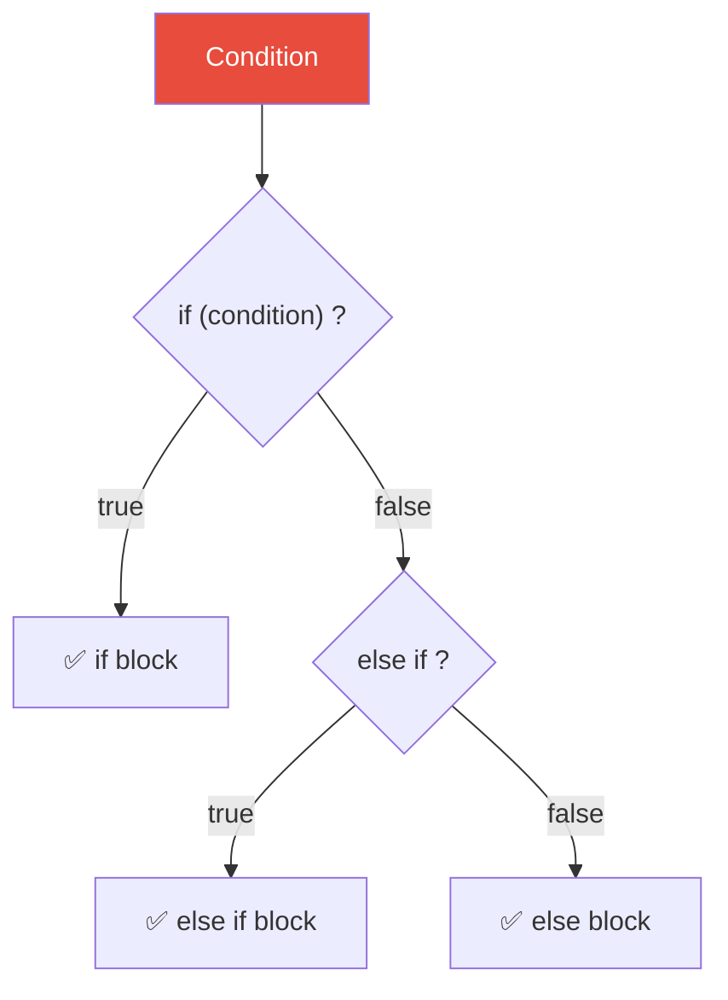

| File | Concept |
|------|---------|
| `48_IF_ESLE.js` | Basic if-else syntax |
| `49_If_elseif_else.js` | Chained conditions |
| `50_REAL_IF_ELSE.js` | Real-world example |
| `51_API_IF_ELSE.js` | API-style branching |
| `56_IQ_EVEN_ODD.js` | Even-odd check |
| `57_Grade_Calc.js` | Grade calculator |
| `58_LEAP_YEAR.js` | Leap year detection |

</details>

<details open>
<summary><strong>🟡 Chapter 08 — Switch Statement</strong></summary>
<br>

Covers `switch` / `case` for multi-way branching — including fall-through behavior, `break`, `default`, grouped cases, and interview patterns.

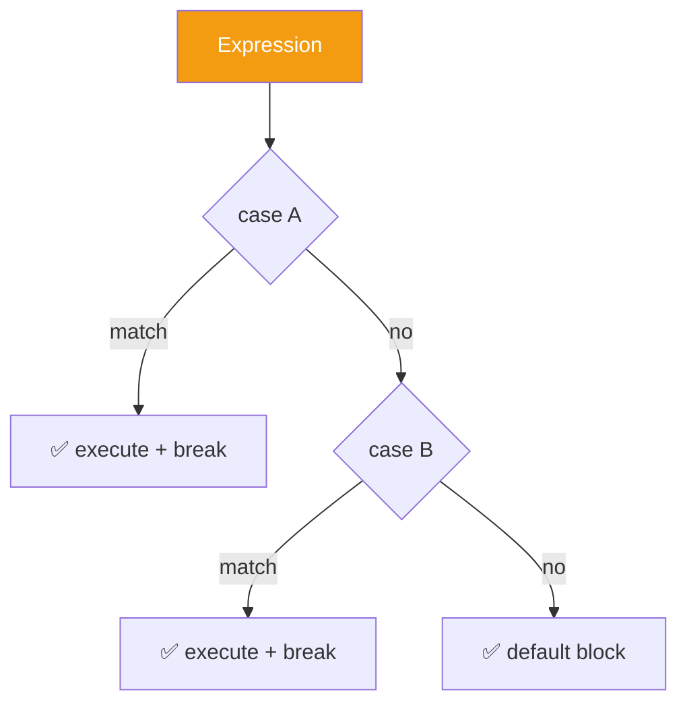

| File | Concept |
|------|---------|
| `59_Switch.js` | Basic switch syntax |
| `60_No_Break.js` | Fall-through (no break) |
| `61_Default.js` | Default case |
| `62_REAL_TIME_EXAMPLE.js` | Real-world usage |
| `63_Switch_Group.js` | Grouped cases |
| `64_IQ.js` — `67_IQ4.js` | Interview patterns |

</details>

<details open>
<summary><strong>🔵 Chapter 09 — User Input</strong></summary>
<br>

Covers reading user input in Node.js — from low-level `readline` to the convenient `prompt-sync` package.

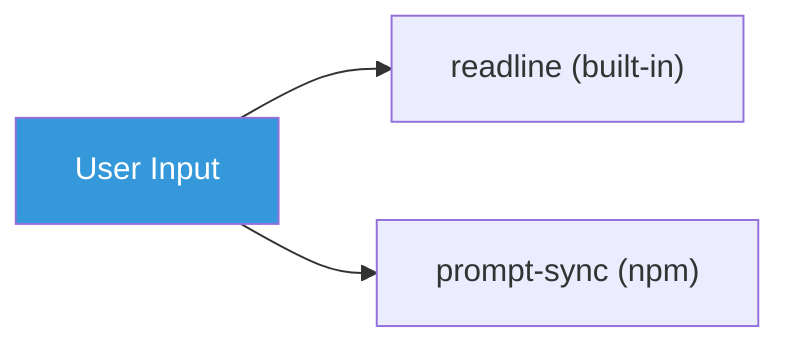

| File | Concept |
|------|---------|
| `68_User_Input.js` | Basic input handling |
| `69_Node_readline.js` | Node.js `readline` module |
| `70_prompt_sync.js` | Using `prompt-sync` package |

</details>

<details open>
<summary><strong>🟢 Chapter 10 — Loops</strong></summary>
<br>

Covers all major loop types in JS — `for`, `while`, `do-while`, `continue`, and common interview traps.

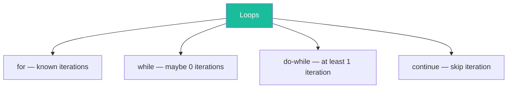

| File | Concept |
|------|---------|
| `71_For_loop.js` | Why loops exist — replacing manual repetition |
| `72_For_loop.js` | For loop with `<=` — 6 iterations (0 through 5) |
| `73_For_Loop2.js` | Loop boundaries: `<` vs `<=` |
| `74_IQ.js` | Conditional logic inside loop |
| `75_For_OF_IN_EACH.js` | While loop — retry logic |
| `76_While.js` | While — init, condition, update |
| `77_Do_While.js` | do-while — guaranteed one execution |
| `78_Do_While.js` | do-while retry pattern |
| `79_IQ.js` | While countdown (`i--`) |
| `80_IQ.js` | do-while off-by-one trap |
| `81_IQ.js` | `continue` — skip current iteration |
| `82_IQ.js` | do-while infinite-loop risk |

</details>

<details open>
<summary><strong>🔴 Chapter 11 — Arrays</strong></summary>
<br>

Covers array creation, access, modification, searching, iteration, and transformation in JavaScript.

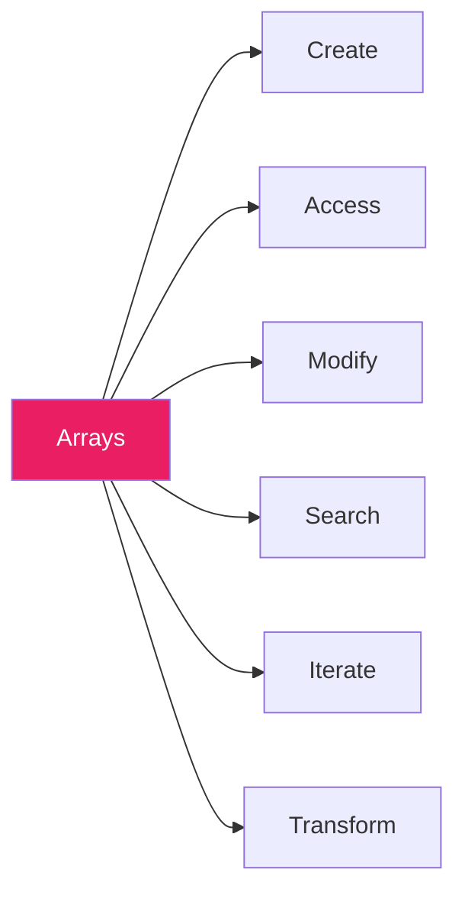

| File | Concept |
|------|---------|
| `83_Arrays.js` | Array creation and basic operations |
| `84_Arrays.js` | More array examples |
| `85_Access_Array.js` | Accessing array elements |
| `86_Arrays_Adding_Remove.js` | Adding and removing elements |
| `87_Adding_Remove2.js` | More add/remove techniques |
| `88_REAL_Example.js` | Real-world array example |
| `89_Searching.js` | Searching within arrays |
| `90_Iterate.js` | Iterating over arrays |
| `91_Transform_Array.js` | Transforming arrays (map, filter, etc.) |
| `92_Arrays.js` | More array creation and manipulation |
| `93_Array_Slicing.js` | Slicing arrays with slice() |
| `94_Concat_array.js` | Concatenating arrays with concat() |
| `95_Array_Checking.js` | Checking array contents and conditions |

</details>

<details open>
<summary><strong>🟣 Chapter 12 — Functions</strong></summary>
<br>

Covers function declaration, parameters, return values, function expressions, arrow functions, and template literals.

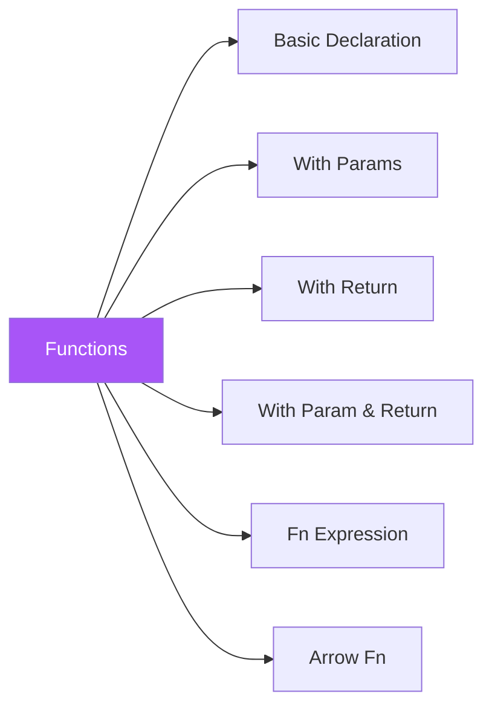

| File | Concept |
|------|---------|
| `96_Functions.js` | Function basics — declaration and invocation |
| `97_Type1_Fn_Basic_Functions.js` | Type 1: Basic function (no param, no return) |
| `98_Type2_Fn_With_Param_No_Return.js` | Type 2: Function with parameters, no return |
| `99_Type3_Fn_without_Param_Return_Type.js` | Type 3: Function without params, with return |
| `100_Type4_Fn_With_Param_With_Return.js` | Type 4: Function with params and return |
| `101_Template_literal.js` | Using template literals in functions |
| `102_Fn_Expression.js` | Function expressions |
| `103_Arrow_Fn.js` | Arrow function syntax |
| `104_Arrow_Fn_REAL.js` | Real-world arrow function usage |
| `105_IIFE.js` | Immediately Invoked Function Expressions |
| `106_Default_Param_Fn.js` | Default parameter values |
| `107_IQ.js` | Interview question — default params |
| `108_Rest_Param_Fn.js` | Rest parameters (`...args`) |
| `109_IQ.js` | Interview question — rest params |
| `110_Spead_IQ.js` | Spread operator interview question |
| `111_Scope._Fn.js` | Function scope rules |
| `112_IQ.js` | Scope interview question |
| `113_Closure.js` | Closures introduction |
| `114_Closure.js` | Closures advanced |
| `115_API_REAL_Closure.js` | Real API use-case with closures |
| `116_Higher_Order_Fn.js` | Higher-order functions (map/filter/reduce) |
| `117_Pure_Fn.js` | Pure functions and side effects |

</details>

<details open>
<summary><strong>🔴 Chapter 13 — Strings</strong></summary>
<br>

Covers string creation, properties, searching, substring extraction, and transformation methods in JavaScript.

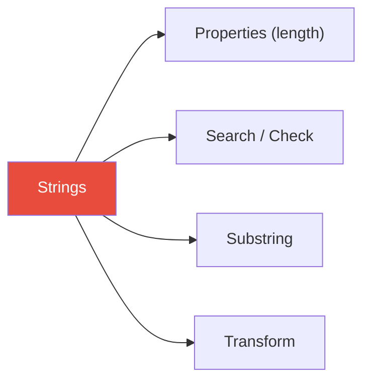

| File | Concept |
|------|---------|
| `118_Strings.js` | String basics and creation |
| `119_String_Properties.js` | `length` and string properties |
| `120_Search_Check_Str.js` | `includes`, `startsWith`, `endsWith`, `indexOf` |
| `121_Substring.js` | `slice`, `substring`, `substr` |
| `122_Transform_Str.js` | `toUpperCase`, `toLowerCase`, `trim`, `replace`, `split` |
| `123_String_Conversion.js` | Type conversion — `toString()`, `Number()`, `parseInt()`, `parseFloat()` |
| `123_SC.js` | String conversion quick-reference cheat sheet |

</details>

<details open>
<summary><strong>🟡 Chapter 14 — Objects</strong></summary>
<br>

Covers object creation, access, methods, destructuring, spread, getters/setters, and the difference between primitive and reference types.

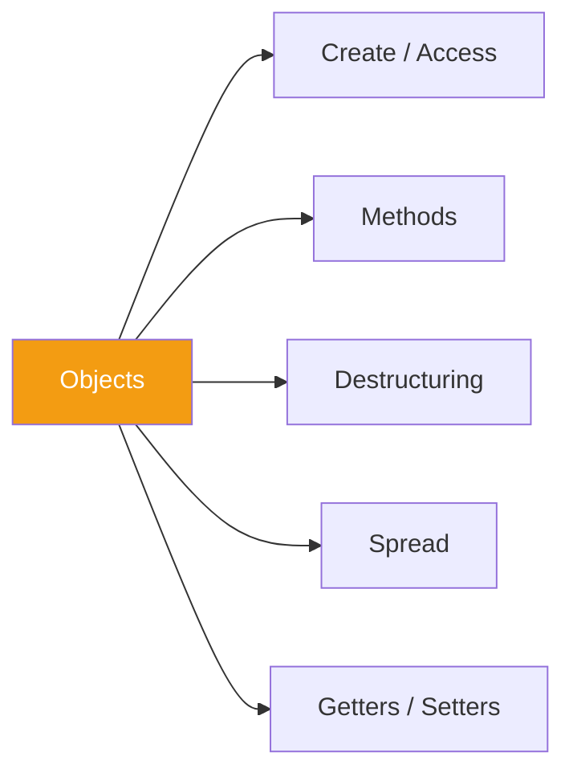

| File | Concept |
|------|---------|
| `124_Objects.js` | Object basics — key/value pairs |
| `125_Objects2.js` | More object examples |
| `126_Objects_Creation.js` | Object literal, `new Object()`, constructor |
| `127_Objects_REAL.js` | Real-world object usage |
| `128_Primitive_Ref.js` | Primitive vs reference type behaviour |
| `129_Ob_Examples.js` | Object examples |
| `130_IQ.js` | Interview question |
| `131_Object_Fn.js` | Object methods |
| `132_Obj_Decon.js` | Object destructuring |
| `133_Spead.js` | Object spread (`...`) |
| `134_Objects_GET_SET_Methods.js` | Getters and setters |
| `135_IQ` | Object interview questions |
| `136_Obj_REAL.js` | Real-world object patterns |
| `137_Let_const_obj.js` | `let` vs `const` with objects |

</details>

<details open>
<summary><strong>🔵 Chapter 15 — 2D Arrays</strong></summary>
<br>

Covers multi-dimensional arrays, matrix operations, and real-world patterns like test data grids.

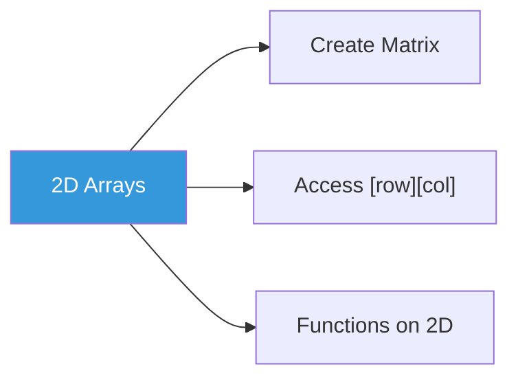

| File | Concept |
|------|---------|
| `138_2D_Array.js` | 2D array creation and access |
| `139_2d.js` | 2D array basics — matrix vs grid, `grid[row][col]`, `.length` |
| `139_2D_Array_IQ.js` | 2D array basics — matrix vs grid, row/col access |
| `140_REAL.js` | Real-world 2D array usage — test matrix iteration |
| `141_2d_Array_Fn.js` | Functions on 2D arrays — map/reduce, finding failures |
| `142_IQ_Right_Pattern_Py.js` | Interview question — right-aligned star pattern |

</details>

<details open>
<summary><strong>🟢 Chapter 16 — Callbacks</strong></summary>
<br>

Covers the callback pattern — synchronous vs asynchronous callbacks, callback hell, and Playwright-specific callback usage.

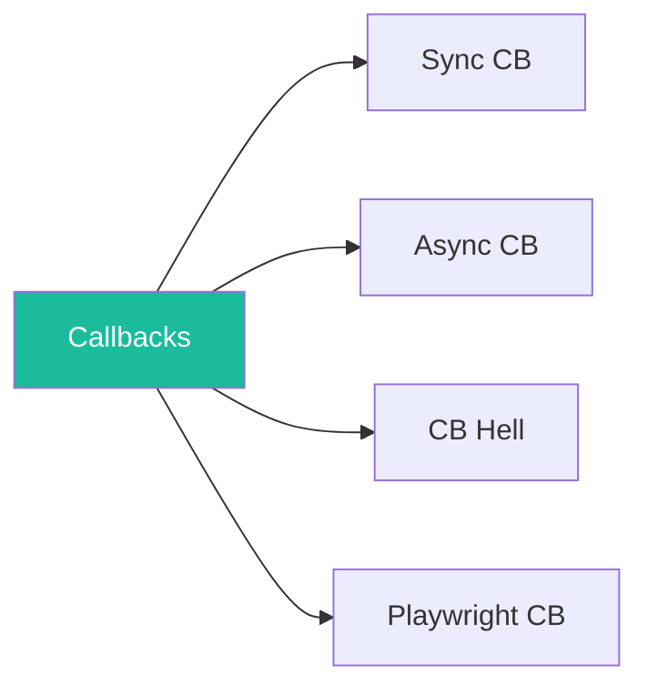

| File | Concept |
|------|---------|
| `143_Callback.js` | Callback basics |
| `144_CB.js` | More callback patterns |
| `145_CB_Fn.js` | Callback as function argument |
| `146_PW_CB.js` | Playwright-style callbacks |
| `147_JS_CB.js` | Async callback — why `setTimeout` runs after sync code |
| `148_Sync_CB.js` | Synchronous callback |
| `149_Async_CB.js` | Asynchronous callback with expected output |
| `150_CB_Hell.js` | Callback hell — E2E login flow (4 steps) |
| `151_CB_Hell_20_Steps.js` | Pyramid of Doom — 24-step full checkout journey |
| `152_CB_Parameter.js` | Callback with parameters, `forEach` sync callback |
| `153_CB_Return.js` | Callback with return value |

</details>

<details open>
<summary><strong>🔴 Chapter 17 — Promises</strong></summary>
<br>

Covers the Promise API — resolve/reject, chaining, `finally`, `Promise.all`, and real API call patterns. Files include inline expected outputs for easy reference.

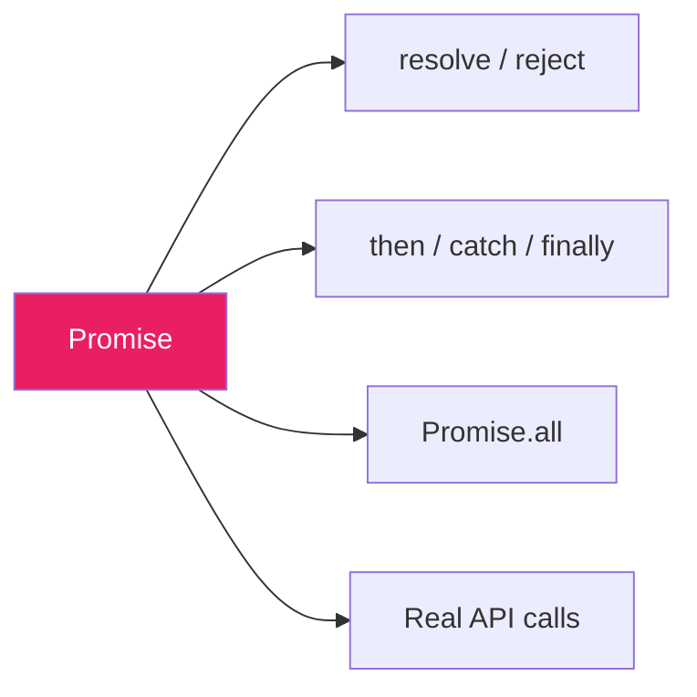

| File | Concept |
|------|---------|
| `154_Promise.js` | Promise basics — resolve/reject |
| `155_Promise_REAL_API.js` | Real API call with Promise |
| `156_Promise_REAL_API_PART2.js` | Real API call — Part 2 |
| `157_Finally.js` | `finally` block |
| `158_Call_Py_Problem.js` | Callback pyramid → Promise solution |
| `159_Promise_ALL.js` | `Promise.all` — parallel execution |
| `160_Promise_IQ.js` | Promise interview question |

</details>

<details open>
<summary><strong>🟢 Chapter 18 — Async / Await</strong></summary>
<br>

Covers `async`/`await` syntax — sequential vs parallel execution, real login flows, and interview patterns. Files include inline expected outputs for easy reference.

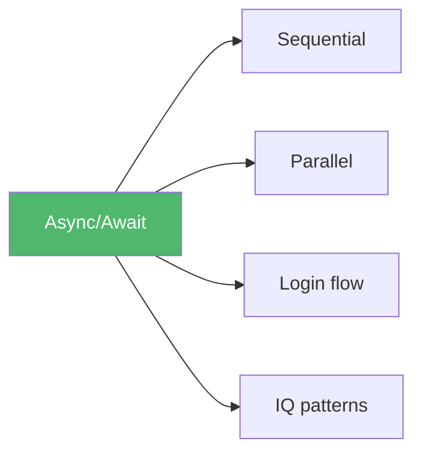

| File | Concept |
|------|---------|
| `161_Async.js` | `async`/`await` basics |
| `162_Aysnc_P2.js` | Async — Part 2 |
| `163_PyODom.js` | Pyramid of doom → async solution |
| `164_Async_Ex.js` | Async examples |
| `165_AA_Parallel.js` | Parallel execution with `Promise.all` |
| `165_AA_Seq.js` | Sequential async execution |
| `166_IQ.js` | Async interview question |
| `167_ACLogin.js` | Real login automation with async/await |

</details>

<details open>
<summary><strong>🔵 Chapter 19 — Playwright Basics</strong></summary>
<br>

First hands-on Playwright tests — login flow validation and cart page assertions on TTA Cart using `@playwright/test`.

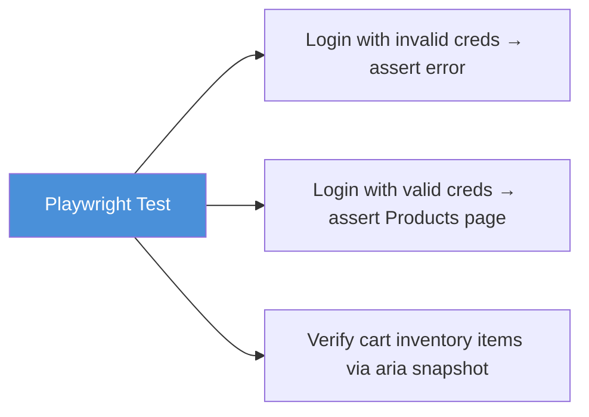

| File | Concept |
|------|---------|
| `playwright.config.ts` | Full Playwright config — `testDir`, `fullyParallel`, CI retries/workers, HTML reporter, `headless: false`, trace on retry, Chromium project |
| `package.json` | Project dependencies (`@playwright/test`) |
| `tests/tta_cart_login.spec.ts` | Login validation (invalid creds → error), successful login → Products page, aria snapshot of all 6 cart items |
| `tests/codegen-tta-cart.spec.ts` | Codegen-generated test — invalid login flow, error banner visibility and text assertion, TTACart heading check |

</details>

<details open>
<summary><strong>🟣 Chapter 20 — TypeScript Basics</strong></summary>
<br>

Covers ES module patterns used in Playwright projects — named/default exports, imports, logger utilities, shared test helpers, and a deep-dive on Objects vs Classes.

```mermaid
flowchart LR
    TU["testutils.js<br/>BASE_URL · formatUpperCaseString"] -->|named import| EI["168_EXPORT_IMPORT.js"]
    L["logger.js<br/>log (default) · log2 (named)"] -->|default import| LG["170_Logger.js"]
    OC["Objects vs Classes<br/>literals · blueprints · inheritance"] --> OCD["Objects_vs_Classes.md"]
    style TU fill:#a855f7,color:#fff
    style L fill:#a855f7,color:#fff
    style EI fill:#a855f7,color:#fff
    style LG fill:#a855f7,color:#fff
    style OC fill:#a855f7,color:#fff
    style OCD fill:#a855f7,color:#fff
```

| File | Concept |
|------|---------|
| `package.json` | `"type": "module"` — enables ES module (`import`/`export`) syntax in Node.js |
| `logger.js` | Default export `log()` + named export `log2()` — logging utilities |
| `testutils.js` | Named exports — `BASE_URL` constant and `formatUpperCaseString()` helper |
| `utils.js` | General helper functions |
| `EXPORT_IMPORT/168_EXPORT_IMPORT.js` | Named import of `BASE_URL` and `formatUpperCaseString` from `testutils.js` |
| `EXPORT_IMPORT/ExplainDefault.md` | Named vs default export explained with side-by-side comparison |
| `EXPORT_IMPORT/170_Logger.js` | Default import of `log` from `logger.js` |
| `Objects_vs_Classes.md` | Objects vs Classes — literals, blueprints, destructuring, inheritance, getters/setters, static, private fields |

</details>

<details open>
<summary><strong>🔴 Chapter 21 — OOPs (Object-Oriented Programming)</strong></summary>
<br>

Introduces Object-Oriented Programming in JavaScript — class syntax, constructors, methods, private fields (`#`), and static members.

```mermaid
flowchart LR
    OOP["OOPs"] --> C["Class & Object"]
    OOP --> CON["Constructor"]
    OOP --> M["Methods"]
    OOP --> PF["Private Fields #"]
    OOP --> ST["Static"]
    style OOP fill:#e74c3c,color:#fff
```

| File | Concept |
|------|---------|
| `171_Class_Object.js` | Basic class structure — attributes and behaviour (Person) |
| `172_Class_Object2.js` | Constructor — auto-runs on object creation |
| `173_Car.js` | Constructor + method — `drive()` per instance |
| `174_REAL_Browser.js` | Real-world class — `TestCase` with `display()` method; function vs method |
| `175_IQ.js` | Browser class — `startBrowser()` / `closeBrowser()`, instance properties |
| `176_Private_Public.js` | Private fields (`#apiKey`) vs public fields — encapsulation |
| `177_Statis.js` | Static fields & methods — shared across all instances (Student) |
| `178_Statis.js` | Static fields — `nationality` shared on Person class |

</details>

<details open>
<summary><strong>🟢 Chapter 22 — Encapsulation</strong></summary>
<br>

Hides internal data behind `#private` fields and exposes it **only** through public methods. The object guards its own state — a setter can validate before allowing a write.

```mermaid
flowchart LR
    Caller -->|"deposit(100)"| M[public method]
    Caller -.->|"account.#balance ❌"| X[blocked]
    M -->|validates then writes| P["#balance (private)"]
    M -->|"getBalance()"| Caller
    style P fill:#ffebee,stroke:#c62828
    style X fill:#ffebee,stroke:#c62828
```

| File | Concept |
|------|---------|
| `179_Ecap.js` | `#balance` private — `deposit()` / `getBalance()` are the only doors |
| `180_REAK_EXAMPLE.js` | Read `#child1` via `getChild1()`, change via `setChild1()` |
| `181_Ecap_Car.js` | `getEngine` / `setEngine` wrap a private `#engine` |
| `182_ECap_Bank.js` | Guarded setter — `setBalance` mutates only when `isCashier` |

</details>

<details open>
<summary><strong>🟠 Chapter 23 — Inheritance</strong></summary>
<br>

A child class `extends` a parent — reusing its fields/methods, adding its own, optionally overriding. `super(...)` calls the parent constructor; `super.method()` calls the parent's method.

```mermaid
classDiagram
    BasePage <|-- LoginPage
    BasePage <|-- DashboardPage
    BasePage <|-- CartPage
    BasePage : +open()
    BasePage : +close()
    LoginPage : +verify()
    DashboardPage : +verify()
    CartPage : +verify()
```

| File | Concept |
|------|---------|
| `183_Single_Inheritance.js` | `LoginPage extends BasePage` — child reuses `open()`/`close()` |
| `184_SI_Example.js` | `super(name)` runs the parent constructor first |
| `185_Single_Inheritance_Con.js` | Child `setup()` replaces parent's |
| `186_IQ.js` | `super.method()` — call the parent's version, then add to it |
| `187_IQ2.js` | Polymorphic loop — one array, each `execute()` differs |
| `188_REAL_PageObject_Model.js` | Real POM — `BasePage` → `Login`/`Dashboard`/`Cart`, each `verify()` |
| `189_Multiple_Inheritance.js` | `extends A, B` is a `SyntaxError` — JS forbids it |
| `190_Multiple_Level_Inheritance.js` | Multi-level — `BasePage` → `AuthPage` → `AdminPage` |
| `191_Hierarchial_Inheritance.js` | Hierarchical — one parent, many children |

</details>

<details open>
<summary><strong>🟣 Chapter 24 — Polymorphism</strong></summary>
<br>

"Many forms." The same method name (`setup()`, `execute()`, `verify()`) behaves differently depending on the object's actual class. No `if (type === ...)` ladders needed.

```mermaid
flowchart LR
    R["runner.forEach(t => t.execute())"] --> U["UnitTest.execute()"]
    R --> A["APITest.execute()"]
    R --> E["E2ETest.execute()"]
    style R fill:#9b59b6,color:#fff
```

| File | Concept |
|------|---------|
| `192_Method_Overriding.js` | Same `setup()` name — subclass supplies its own body |

</details>

<details open>
<summary><strong>🔴 Chapter 25 — OOP Interview Questions</strong></summary>
<br>

Four warm-up drills tying together classes, constructors, `this`, and method chaining.

| File | Concept |
|------|---------|
| `EX1.js` | `Bug` class — fields + `display()` method |
| `EX2.js` | Constructor default values — `constructor(name = "staging", port = 3000)` |
| `EX3.js` | `this` per object — each instance carries its own `this.name` |
| `EX4.js` | Method chaining — `return this` lets you chain `.increment().display()` |

</details>

<details open>
<summary><strong>🔵 Chapter 26 — TypeScript</strong></summary>
<br>

Introduction to TypeScript — static types, type annotations, and running `.ts` files with Node.js.

| File | Concept |
|------|---------|
| `193_TS.js` | JavaScript baseline used as TS comparison reference |
| `194_TS_HelloWorld.js` / `.ts` | First TypeScript file — type-annotated variables |
| `195_TS_Part1.ts` | TypeScript types — `string`, `number`, `boolean` |
| `196_TS_Part2.ts` | TypeScript — Part 2 topics |
| `197_TS_Part2.ts` | TypeScript — Part 2 continued |
| `198_Part3.ts` | TypeScript — Part 3 |
| `199_IQ.ts` | TypeScript interview question |
| `200_IQ.ts` | TypeScript interview question — continued |

</details>

<details open>
<summary><strong>🟢 Chapter 27 — TypeScript Interface</strong></summary>
<br>

TypeScript interfaces — defining object shapes, optional properties, and `readonly` constraints.

| File | Concept |
|------|---------|
| `201_IF.ts` | Interface basics — defining object shape with `interface` |
| `202_IF_Part2.ts` | Interface — Part 2 |
| `203_IF_READONLY.ts` | `readonly` properties — prevent mutation after assignment |
| `204_IF_READOnly.ts` | `readonly` — continued examples |
| `205_Interfaces.ts` | Interface with method signatures + arrow-function property syntax (`Calculator`) |
| `206_Hooks.ts` | Interface modeling Playwright-style test hooks |
| `207_Bug REPORT.ts` | Interface for a structured bug report shape |
| `208_TestConfig.ts` | Interface for test configuration objects |
| `209_REAL_EXAMPLE.ts` | Real-world interface usage example |
| `210_Class_Interface.ts` | A class `implements` an interface |

</details>

<details open>
<summary><strong>🟤 Chapter 28 — Enums</strong></summary>
<br>

TypeScript `enum` — naming a fixed set of related constants (test status, environments) instead of using raw strings.

```mermaid
flowchart LR
    E["enum TestStatus"] --> P["Pass = 'PASS'"]
    E --> F["Fail = 'FAIL'"]
    E --> S["Skip = 'SKIP'"]
    style E fill:#e91e63,color:#fff
```

| File | Concept |
|------|---------|
| `211_ENUM.ts` | String enum — `TestStatus.Pass` |
| `212_Enum_Fn.ts` | Using an enum value as a function parameter type |
| `213_ENUM.ts` | More enum patterns |
| `214_API_.ts` | Enum applied to a real API-style example |

</details>

<details open>
<summary><strong>🟣 Chapter 29 — TypeScript Generics</strong></summary>
<br>

Generics (`<T>`) let a function or class work with any type while keeping full type safety — no `any`, no duplicated overloads.

```mermaid
flowchart LR
    G["getFirstResult&lt;T&gt;(results: T[])"] --> N["&lt;number&gt;([200,400,500]) → number"]
    G --> S["&lt;string&gt;(['Login','Signup']) → string"]
    style G fill:#a855f7,color:#fff
```

| File | Concept |
|------|---------|
| `215_Generic.ts` | Generic function `getFirstResult<T>` — non-null assertion (`!`) |
| `216_Generic_Class.ts` | Generic class |
| `217_Generic_API_RESPONSE.ts` | Generic `ApiResponse<T>` shape for API data |

</details>

<details open>
<summary><strong>🔴 Chapter 30 — Private / Public / Protected</strong></summary>
<br>

TypeScript access modifiers — `public` (default, open everywhere), `private` (class-only), `protected` (class + subclasses) — plus `readonly` and `abstract` classes.

```mermaid
classDiagram
    APIClient <|-- UserAPIClient
    APIClient : +baseURL string
    APIClient : -apiKey string
    APIClient : #timeout number
    APIClient : -getAuthHeader()
    APIClient : +sendRequest()
    UserAPIClient : +getUsers()
```

| File | Concept |
|------|---------|
| `218_PPP.ts` | `public`/`private`/`protected` fields — subclass can read `protected`, not `private` |
| `219_PageObjectModel.ts` | Access modifiers applied to a Page Object Model |
| `220_READONLY.ts` | `readonly` fields — set once, immutable after |
| `221_Abstract_Class.ts` | `abstract class` — can't be instantiated directly, forces subclasses to implement |

</details>

<details open>
<summary><strong>🟠 Chapter 31 — Type Override & Decorators</strong></summary>
<br>

Type assertions (`as`), type aliases, method `override`, and experimental class/method decorators.

```mermaid
flowchart LR
    U["unknown"] -->|"as elementI"| T["typed object"]
    B["base method"] -->|"override"| D["derived method"]
    C["class"] -->|"@decorator"| CD["enhanced class"]
    style U fill:#f39c12,color:#fff
```

| File | Concept |
|------|---------|
| `222_Type_As.ts` | `as` assertion — narrow `unknown` to a known interface shape |
| `223_Type_Alias_As.ts` | `type` alias combined with `as` assertions |
| `224_Override.ts` | `override` keyword on subclass methods |
| `225_IQ.ts` | Type override interview question |
| `226_Decorator.ts` | Class decorator basics |
| `227_Decortors_2.ts` | Decorators — part 2 |
| `228_Multiple_Decor.ts` | Stacking multiple decorators on one class/method |

</details>

<details open>
<summary><strong>🔵 Chapter 32 — Playwright Fundamentals</strong></summary>
<br>

A fresh, standalone Playwright TypeScript project (own `package.json`/`tsconfig.json`) — config setup and a first real browser test against a live site.

```mermaid
flowchart LR
    C["playwright.config.ts"] --> T["tests/example.spec.ts"]
    T --> G["page.goto(TTA Cart)"]
    G --> A["expect(page).toHaveTitle(...)"]
    style C fill:#4a90d9,color:#fff
```

| File | Concept |
|------|---------|
| `playwright.config.ts` | Chromium project, HTML reporter, trace on first retry, CI-aware retries/workers |
| `tsconfig.json` | Local override of the repo's strict root config (`types: ["node"]`, relaxed `verbatimModuleSyntax`/`exactOptionalPropertyTypes`) so `process.env` and CommonJS `import` syntax type-check |
| `tests/example.spec.ts` | First test — navigates to TTA Cart and asserts the page title |

</details>

<details open>
<summary><strong>⚪ Assignments</strong></summary>
<br>

Hands-on exercises covering HTTP status categorization, test pass/fail verdicts, bug severity classification, build health reporting, and login lockout logic.

| File | Concept |
|------|---------|
| `Assignment_1.js` | HTTP Status Code Categorizer |
| `Assignment_2.js` | Test Case Pass/Fail Verdict |
| `Assignment_3.js` | Bug Severity Classifier |
| `Assignment_4.js` | Build Health Reporter |
| `Assignment_5.js` | Login Lockout After Failed Attempts |
| `Assignment_6.js` | Triangle Classifier |
| `Assignment_7.js` | FizzBuzz Test |
| `Assignment_8.js` | String Reverse & Palindrome Check |
| `Assignment_9.js` | Anagram Checker |
| `Assignment_10.js` | Reverse Star Pattern |
| `Assignment_11.js` | Triangle Star Pattern |
| `Assignment_12.js` | Calculator Class — addition, subtraction, multiplication, division, modulus using OOP |
| `Assignment_13.js` | PlaywrightClass — static/non-static fields & methods, 10 student objects with `studentDetails()` |
| `Assignment_14.js` | Token class — private `#value` field, `getToken()` and `getMasked()` with partial masking (`***XXXX`) |

</details>

---

## ⌨️ VS Code Shortcuts

Quick reference guides for **Mac** and **Windows**:

| Platform   | File                                                                                             |
| ---------- | ------------------------------------------------------------------------------------------------ |
| 🍎 Mac     | [`VS_Code_shortcuts_mac.md`](Chapter_03_JS_Identifier_Literals/VS_Code_shortcuts_mac.md)         |
| 🪟 Windows | [`VS_Code_shortcuts_windows.md`](Chapter_03_JS_Identifier_Literals/VS_Code_shortcuts_windows.md) |

---

## 🛠️ Tech Stack

- **Playwright** — Browser automation
- **JavaScript (ES6+)** — Programming language
- **Node.js** — Runtime environment

---

<div align="center">
  <sub>Built with ❤️ by Hemalatha</sub>
</div>
