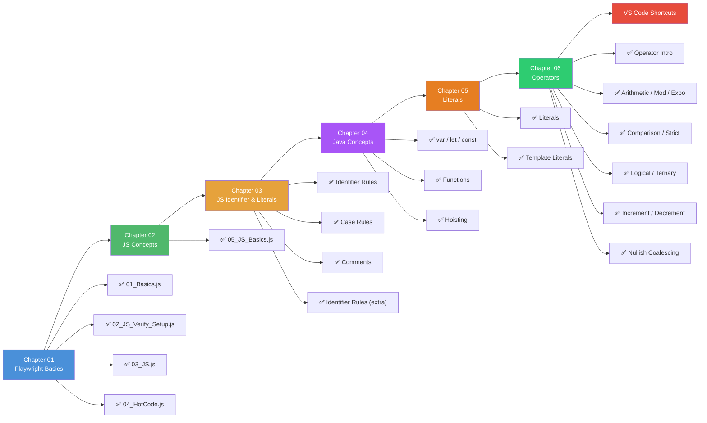

# 🎭 Playwright

> A hands-on journey into **Playwright** automation with **JavaScript** 🚀

[](https://github.com/Hemalatha-R17/Playwright)
[](https://github.com/Hemalatha-R17/Playwright)
[](https://github.com/Hemalatha-R17/Playwright)

<div align="center">

  

</div>

---

## 🗺️ Learning Flow



---

## 📂 Chapters

| #   | Chapter                      | 📄 Files                                                                                                                                                             |
| --- | ---------------------------- | -------------------------------------------------------------------------------------------------------------------------------------------------------------------- |
| 01  | **Playwright Basics**        | `01_Basics.js` · `02_JS_Verify_Setup.js` · `03_JS.js` · `04_HotCode.js`                                                                                              |
| 02  | **JS Concepts**              | `05_JS_Basics.js`                                                                                                                                                    |
| 03  | **JS Identifier & Literals** | `06_Identifier_Rules.js` · `07_Identifier_Case_Rules.js` · `08_Comments.js` · `js_identifier_rules.js` · `VS_Code_shortcuts_mac.md` · `VS_Code_shortcuts_windows.md` |
| 04  | **Java Concepts**            | `09_var_let_const.js` · `10_functions.js` · `11_var_explained.js` · `12_let_people_love.js` · `13_const_explained.js` · `14_var_functionscope.js` · `15_let_scope.js` · `16_Hoisting.js` · `17_hoisting_fn.js` |
| 05  | **Literals**                 | `22_Literal.js` · `23_null_undefined.js` · `24_null.js` · `25_Literal_All.js` · `26_Literal_Number_all.js` · `27_String.js` · `28_Template_Literal.js` · `29_Backtick_single_double.js` |
| 06  | **Operators**                | `30_Operator.js` · `31_Arithmetic_OP.js` · `32_Module_OP.js` · `33_Expo_OP.js` · `34_IQ_Compound_OP.js` · `35_Comparision_OP.js` · `36_Comparision_Strict_loose.js` · `37_IQ_Loose_Strict.js` · `38_Confusing_Comparision.js` · `39_Logical_OP.js` · `40_String_Con_OP.js` · `41_Ternary_OP.js` · `42_Type_OP.js` · `43_Incre_Decre_OP.js` · `44_Null_OP.js` |

---

## 📁 Folder Structure

```
Playwright/
├── README.md
├── .gitignore
├── Chapter_01_Basics/
│   ├── 01_Basics.js
│   ├── 02_JS_Verify_Setup.js
│   ├── 03_JS.js
│   └── 04_HotCode.js
├── Chapter_02_JS_Concepts/
│   └── 05_JS_Basics.js
├── Chapter_03_JS_Identifier_Literals/
│   ├── 06_Identifier_Rules.js
│   ├── 07_Identifier_Case_Rules.js
│   ├── 08_Comments.js
│   ├── js_identifier_rules.js
│   ├── VS_Code_shortcuts_mac.md
│   └── VS_Code_shortcuts_windows.md
├── Chapter_04_JavaConcepts/
│   ├── 09_var_let_const.js
│   ├── 10_functions.js
│   ├── 11_var_explained.js
│   ├── 12_let_people_love.js
│   ├── 13_const_explained.js
│   ├── 14_var_functionscope.js
│   ├── 15_let_scope.js
│   ├── 16_Hoisting.js
│   ├── 17_hoisting_fn.js
│   ├── 18_let_hoisting.js
│   ├── 19_let_hoisting_block.js
│   ├── 20_let_const.js
│   └── 21_Jr_QA.js
├── Chapter_05_Literal/
│   ├── 22_Literal.js
│   ├── 23_null_undefined.js
│   ├── 24_null.js
│   ├── 25_Literal_All.js
│   ├── 26_Literal_Number_all.js
│   ├── 27_String.js
│   ├── 28_Template_Literal.js
│   └── 29_Backtick_single_double.js
└── Chapter_06_Operator/
    ├── 30_Operator.js
    ├── 31_Arithmetic_OP.js
    ├── 32_Module_OP.js
    ├── 33_Expo_OP.js
    ├── 34_IQ_Compound_OP.js
    ├── 35_Comparision_OP.js
    ├── 36_Comparision_Strict_loose.js
    ├── 37_IQ_Loose_Strict.js
    ├── 38_Confusing_Comparision.js
    ├── 39_Logical_OP.js
    ├── 40_String_Con_OP.js
    ├── 41_Ternary_OP.js
    ├── 42_Type_OP.js
    ├── 43_Incre_Decre_OP.js
    └── 44_Null_OP.js
```

---

## ⌨️ VS Code Shortcuts

Quick reference guides for **Mac** and **Windows**:

| Platform   | File                                                                                             |
| ---------- | ------------------------------------------------------------------------------------------------ |
| 🍎 Mac     | [`VS_Code_shortcuts_mac.md`](Chapter_03_JS_Identifier_Literals/VS_Code_shortcuts_mac.md)         |
| 🪟 Windows | [`VS_Code_shortcuts_windows.md`](Chapter_03_JS_Identifier_Literals/VS_Code_shortcuts_windows.md) |

---

## 🛠️ Tech Stack

- **Playwright** — Browser automation
- **JavaScript (ES6+)** — Programming language
- **Node.js** — Runtime environment

---

<div align="center">
  <sub>Built with ❤️ by Hemalatha</sub>
</div>
